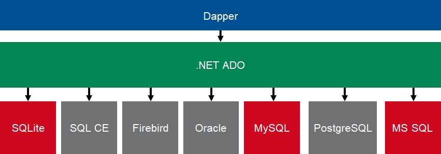

# Dapper Playground

Playground for testing the StackExchange object mapping Library [Dapper](https://github.com/StackExchange/Dapper).

See this page for more first hand examples: [Dapper Tutorial](https://dapper-tutorial.net/dapper)

Run all tests: `dotnet test ./src`

## DBMS used

Dapper supports a variety of database management systems (DBMS). In this sample project the following DBMS were used:

* Microsoft SQL Server (MS SQL)
* SQLite
* MySQL



### Dockerized DB instances

All examples can be run against the respective dockerized database systems. Run  to start.

## Code Samples

This project consists mainly of code samples showing how queries and commands can be executed by using Dapper.

``` c#
    /// Object with the data, that will be inquired.
    public class OrderItem
    {
        public int Id { get; }
        public string CustomerName { get; }
        public DateTime OrderDate { get; }
        public string Address { get; }
    }

    public class DapperQuery
    {
        private const string Sql = @"
            SELECT TOP (20)
                o.OrderID                   AS [Id],
                c.ContactName               AS [CustomerName],
                o.OrderDate                 AS [OrderDate],
                o.ShipAddress               AS [Address],
            FROM
                [dbo].[Orders] AS o
            INNER JOIN [dbo].[Customers] AS C
                ON c.[CustomerID] = o.[CustomerID]
            ORDER BY
                c.ContactName";

        private readonly System.Data.IDbConnection connection;

        public DapperQuery(IDbConnection openConnection)
        {
            this.connection = openConnection;
        }

        public IReadOnlyCollection<OrderItem> GetOrders()
        {
            return this.connection.Query<OrderItem>(Sql).ToList();
        }
    }
```

There are also some examples using NHibernate to display the differences between these two frameworks.

``` c#
    // Sample NHibernate implementation of the same query
    public class NHibernateQuery
    {
        private readonly NHibernate.ISession session;

        public NHibernateQuery(ISession session)
        {
            this.session = session;
        }

        public IReadOnlyCollection<OrderItem> GetOrders(string customerNameContains)
        {
            OrderItem orderItem = null;
            CustomerEntity customerAlias = null;

            return this.session
                .QueryOver<OrderEntity>()
                .JoinAlias(x => x.Customer, () => customerAlias)
                .SelectList(l => l
                    .Select(x => x.Id).WithAlias(() => orderItem.Id)
                    .Select(() => customerAlias.ContactName)
                         .WithAlias(() => orderItem.CustomerName)
                    .Select(x => x.OrderDate).WithAlias(() => orderItem.OrderDate)
                    .Select(x => x.ShippedDate).WithAlias(() => orderItem.ShippedDate)
                    .Select(x => x.ShipAddress).WithAlias(() => orderItem.Address)
                    .Select(x => x.ShipPostalCode).WithAlias(() => orderItem.PostCode)
                    .Select(x => x.ShipCity).WithAlias(() => orderItem.City)
                    .Select(x => x.ShipCountry).WithAlias(() => orderItem.Country))
                .OrderBy(() => customerAlias.ContactName).Desc
                .TransformUsing(Transformers.AliasToBean<OrderItem>())
                .Take(20)
                .List<OrderItem>()
                .ToArray();
        }
    }
```

And some examples show the same queries using Entity Framework (EF).

``` c#
    // Sample Entity Framework implementation of the same query
    public class EFQuery
    {
        private readonly NorthwindContext context;

        public EFQuery(NorthwindContext context)
        {
            this.context = context;
        }

        public IReadOnlyCollection<OrderItem> GetOrders(string customerNameContains)
        {
            var query =
                from o in this.context.Orders
                orderby o.Customers.ContactName descending
                where o.Customers.ContactName.Contains(customerNameContains)
                select new OrderItem
                {
                    Id = o.OrderID,
                    CustomerName = o.Customers.ContactName,
                    OrderDate = o.OrderDate,
                    ShippedDate = o.ShippedDate,
                    Address = o.ShipAddress,
                    PostCode = o.ShipPostalCode,
                    City = o.ShipCity,
                    Country = o.ShipCountry
                };

            return query
                .Take(20)
                .ToArray();
        }
    }
```
